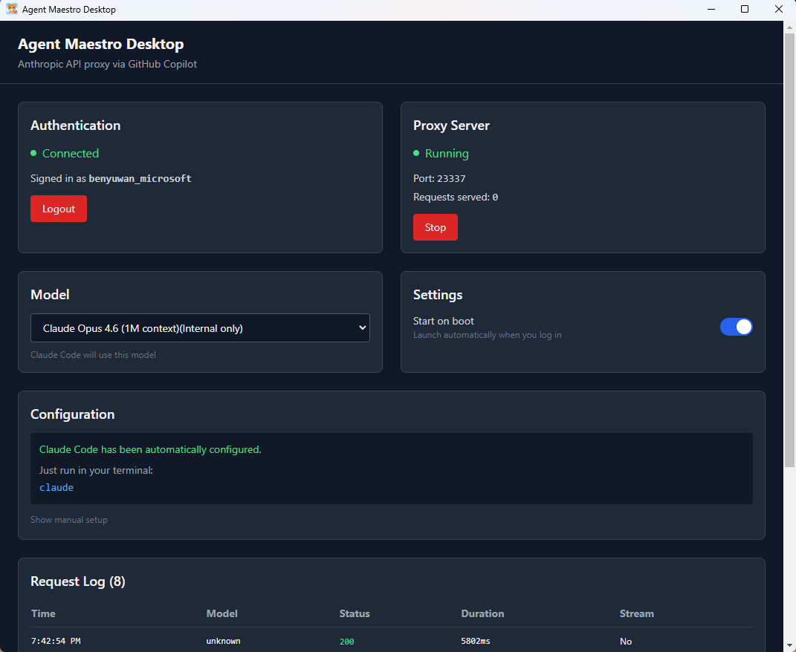

# Agent Maestro Desktop



## Overview

Agent Maestro Desktop is an open-source local desktop application inspired by [agent-maestro](https://github.com/Joouis/agent-maestro).
It proxies Anthropic API requests and allows you to access Claude Code using a GitHub Copilot token.

Key features:
- Local Claude API proxy with Copilot token authentication
- Auto-configures proxy settings for Claude Code, VSCode extension, and local CLI
- Multi-model auto-detection and selection (automatically picks the best model after login)
- Intuitive UI with request logs, model switching, and settings panel
- Cross-platform support for Windows/macOS/Linux

## Installation

> Prerequisite: Node.js 18+ and npm

### Clone the repository
```bash
git clone https://github.com/<your-org>/agent-maestro-desktop.git
cd agent-maestro-desktop
```

### Install dependencies
```bash
npm install
```

### Start development server
```bash
npm run dev
```

### Build production installer
```bash
npm run make
```

The installer will be generated in the `out/make` directory.

## Configuration & Usage

1. Launch the app, click Login, and enter your GitHub Copilot credentials (requires an active Copilot subscription)
2. After login, the app automatically configures Claude Code and VSCode extension to use the local proxy
3. Use the sidebar UI to switch models, view request logs, and modify settings
4. The proxy port defaults to 23337 and can be customized in the settings page

## FAQ

- **Login failed?** Make sure you have an active Copilot subscription and your token has not expired
- **Claude Code / VSCode not connecting?** Check your `~/.claude/settings.json` — the proxy port and token must match
- **Icons not showing?** Clear your Windows icon cache and ensure icon.ico/icon.icns are generated with electron-icon-builder
- **Installer or startup issues?** Try re-running `npm run make` and follow the install wizard

## Contributing

Contributions are welcome! Here's how:
1. Fork this repository
2. Create a new branch: `git checkout -b feat/my-feature`
3. Commit your code with unit tests
4. Open a PR describing your changes and their impact
5. Wait for community/maintainer review and CI to pass

### Code Standards
- TypeScript + React + Electron — use Prettier and ESLint for auto-formatting
- New features should include tests (Vitest/Jest)
- Icons and assets should use CC0 or original artwork to avoid copyright issues

## License

MIT License

## Screenshots


> To add more UI/feature screenshots, place them in `assets/screenshots/` and reference them with Markdown

---

**This project is actively maintained. Feel free to open issues, submit PRs, or join the community!**
